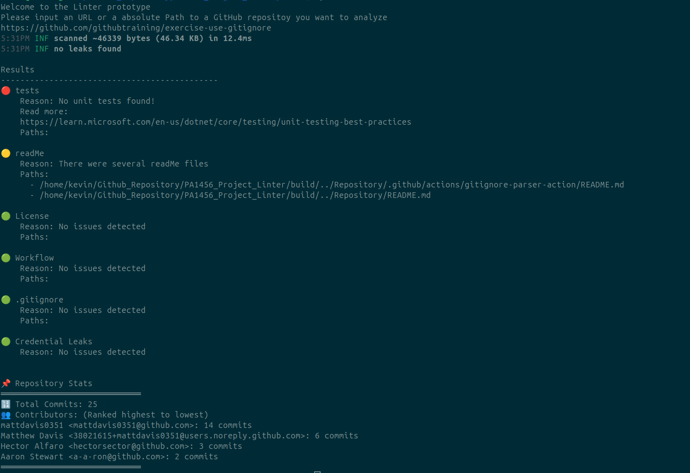
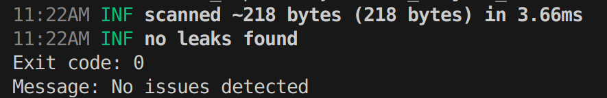

# Project Linter

This repository is part of my **Software Engineering Project course**, where I am developing a **GitHub Linter** using **Agile software development methodologies**.




## Features & Requirements Fulfilled

### General
- ✅ **RQ1.1:** The system shall take a URL to a GitHub repository as an argument.
- ✅ **RQ1.2:** The system shall take a folder path to a git repository as an argument.
- ✅ **RQ1.3:** The system shall summarize all findings with an indicator for passed or failed checks.
- ✅ **RQ1.4:** The system shall be configurable via a config file to adjust the folder where cloned repositories are stored/cached.
- ✅ **RQ1.5:** The system shall be configurable via a config file to define whether a specific check is allowed to fail.
- ✅ **RQ1.6:** The system shall return an exit status code, where a `0` value indicates no errors (checks are green or yellow) and any non-zero exit code indicates that at least one check failed.

### Artifacts
- ✅ **RQ2.1:** The system shall check whether a `.gitignore` file exists.
- ✅ **RQ2.2:** The system shall check whether a `LICENSE` file exists.
- ✅ **RQ2.3:** The system shall check whether GitHub workflow files exist.
- ✅ **RQ2.4:** The system shall list all files with their complete file path that include the word `test`.
- ✅ **RQ2.5:** The system shall ignore directories that are ignored via `.gitignore` when checking files (e.g., `__pycache__` or `node_modules`).

### Security
- ✅ **RQ3.1:** The system shall facilitate a tool to check for credentials that should not be stored in the repository.

### Contributions
- ✅ **RQ4.1:** The system shall summarize the number of commits.
- ✅ **RQ4.2:** The system shall summarize the git names of contributors.
- ✅ **RQ4.3:** The system shall rank (high to low) the git contributions and show commits per contributor.

### Optional Requirements
- ✅ **RQ5.1:** The system shall be containerized via Docker to remove the necessity of having all dependencies installed.
- ✅ **RQ5.2:** The system shall clone a GitHub repository locally for further inspections.
---


## Dependencies

### **Manually Installed Dependencies**
These dependencies must be installed on your system before building the project:

- **Ubuntu 22.04** (Other Linux distributions may work but are untested)
- **GCC 13.3.0** (`gcc (Ubuntu 13.3.0-6ubuntu2~24.04) 13.3.0`)
- **CMake 3.15+** (Required for building the project)
- **C++20** (Ensure your compiler supports C++20)
- **Gitleaks v8.24.0** (For security checks)
- **Go 1.22.2** (`go version go1.22.2 linux/amd64`)
- **libgit2 1.7.2** (Ensure it is installed and accessible)
- **Python3 3.12.3**
- **UnZip 6.00**

### **Dependencies Handled by CMake**
These dependencies are automatically managed by CMake and do not require manual installation:

- **Google Test 1.16.0**
- **FMT 11.1.4**
- **nlohmann JSON Parser 3.11.2**


### Installing and executing the program

#### Using docker

##### Installation
```
$ snap install docker
```
##### Execution

```
$ cd ~/PA1456_Project_Linter/
```

```
$ docker build -t linter-image .
```

```
$ sudo docker run -it linter-image 
```
##### Using a folder as argument in docker
```
$ sudo docker run -it -v <<absolute Path>>:/usr/repo linter-image bash
```

```
$ docker build -t linter-image .
```


##### Running unit test in docker
```
$ sudo docker run -it linter-image bash
```

```
$ ./linterTests
```


#### Manually using CMake

##### Installation
```
$ apt-get update && apt-get install -y \
    cmake \
    golang \
    g++ \
    python3 \
    unzip \
    zlib1g-dev \
    libssl-dev  
```
```
$ apt-get update && apt-get install -y \
    cmake \
    golang \
    g++ \
    python3 \
    unzip \
    zlib1g-dev \
    libssl-dev  
```


```
$ git clone https://github.com/libgit2/libgit2.git
cd libgit2
mkdir build && cd build
cmake -DCMAKE_INSTALL_PREFIX=/usr/local ..
make 
sudo make install

```
```
$ cd ~/PA1456_Project_Linter/
```
```
$ mkdir build && cd build 
cmake ..
cmake --build .
sudo ldconfig
```
##### Execution


```
$ cd ~/PA1456_Project_Linter/build/
```

```
$ ./linter
```
##### Running unit tests

```
$ ./linterTests
```
## Configuring via config file

The config.json makes it possible to changes certain parameters of the system. This is done by replacing 'null' with 'true' under "custom". This makes it possible to disregard certain tests if when turning of the requirment for a file the system will output a "white" indication stating that it ignored this requirment. For the other parameters it will still check but will not give a yellow indication when files lacked content. 

The minimalOutput slims output to look like the image. 



## Description

This can either be run using docker or be manually build and run. It's designed for Linux system and is only tested against Ubuntu 22.04 and lubunut 24.04.2.
### Tests
The project also has unit test and integration tests which can be run in docker by either opening a running the docker with a bash terminal eg. "sudo docker run -it linter-image bash" And manually running ./linterTests. 

The tests clones repositories when it needs to but otherwise tests against dummy repositories. Since git doesn't allows to commit a repository that has several .git within itself they are abstracted in the dummyRepos.zip. And unzipped when building the project using unzip and CMake. This allows for most of the tests to be more independent when testing against other hosted repositories. 

The tests uses Googletest framework. 

## UML

